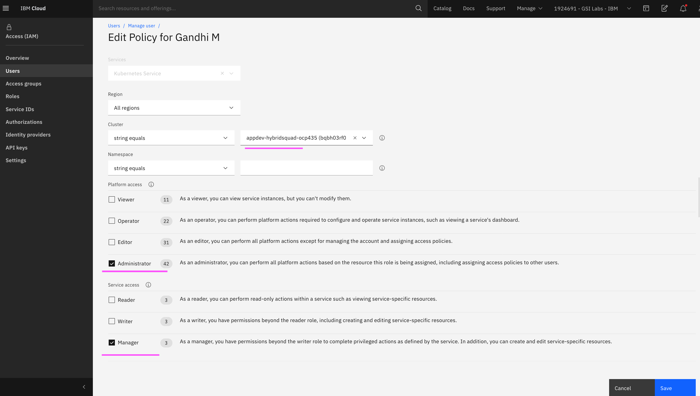

# IAM Access permssions between IBM Cloud and Managed Openshift

In IBM Cloud, the IAM users can have Viewer, Editor and Administrator permissions. Based on this permission the managed openshift allows IAM users to access the cluster.

This document explains the mapping between IAM roles and its authorization in Openshift.

Here are the IAM roles.

```
    Administrator
    Editor
    Operator
    Viewer
```

# Access rights summary

| IAM Role| View all projects and its content | Rights to create New Project | Rights to create other objects like create POD |
| -------------         | -------------                 |-------------              |------------- |
| Administrator   | Yes | Yes | Yes |
| Editor          | Yes | No | Yes |
| Viewer          | Yes | No | No |


# 1. Administrator

Administrator rights been set to the user like the below in the cluster.




The user can able to Create Projects and PODS. 


# 2. Editor

Editor rights been set to the user like the below in the cluster.


The user can't to Create Projects but he can create PODS. 


# 3. Viewer

Viewer rights been set to the user like the below in the cluster.


The user can't to Create both Projects and PODS. 


# Note

To test the access rights, after changing the access rights in IAM do the following steps in sequence otherwise, the changes will not reflect.

1. Logout `cloud.ibm.com` website from the browser
2. Then Logout `Openshift web console` from the browser 


## General

| Topic                 | Sub Topic                     |Link                       | Last Updated| 
| -------------         | -------------                 |-------------              |------------- |
|                   |  |                              |  |

